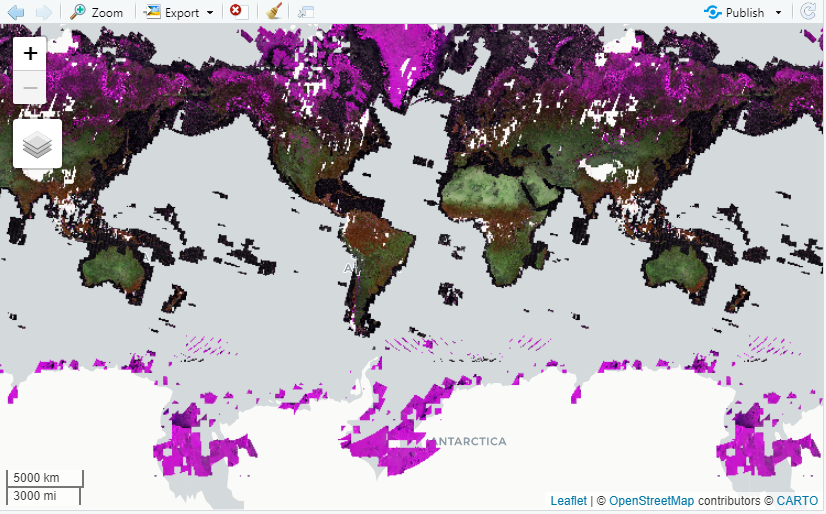

```{r setup, include=FALSE}
knitr::opts_chunk$set(echo = TRUE)
```

## Datos raster

Las imágenes satelitales son en general datos que se presentan en formto raster.  Google Earth Engine es una plataforma que nos permite acceder a muchos datos históricos de diversos satélites por medio de su API (application programming interface, o interfaz de programación de aplicaciones).

Para poder utilizarla programando es necesario que contemos con un usuario y tengamos instalado todo el software detallado en la página del curso.

## rgee y Google Earth Engine

**rgee** es un paquete que hace de interfaz entre R y Google Earth Engine.  Como hemos hecho con los otros paquetes, para poder usarlo tenemos que cargarlo:

```{r}
library(reticulate)
library(rgee)

```

Y ahora inicializamos GEE, para eso vamos a necesitar nuestro usuario habilitado.  La primera vez que lo inicialicemos nos va a solicitar permiso para acceder a GEE por medio de una serie de pantallas en el nevegador de Internet predeterminado.  Autorizamos y se nos brindará una API Key para ingresar en la consola de R. Con eso ya estamos autenticados y con acceso a la plataforma.

```{r eval=FALSE}
ee_Initialize('nombre de usuario')
# si queres trabajar con google drive podes inicializar así: ee_Initialize('nombre de usuario', drive = TRUE)
```

GEE tiene colecciones de productos e imágenes.  ¿Cómo las consulto?. Lo primero es ir al catálogo de GEE para obtener el nombre de la colección.  Yo les dejo los nombres de LANDSAT y SENTINEL, que son dos de las mas utilizadas:


* Sentinel 2: COPERNICUS/S2
* LandSat 8: LANDSAT/LC08

Vamos a consultar SENTINEL porque tiene un pixel más pequeño que LANDSAT y por ende nos puede brindar mayor cantidad de información: 


## Sentinel

```{r eval=FALSE}
# Seleccionando las bandas
bandas <- c('B8A','B4','B11', 'B2', 'B3', 'B5','B6','B7','B8')

# Filtrando los metadatos: usar Abril para mostrar la diferencia 
# en la selección de acuerdo al porcentaje de nubes (40, 10, 90).

imagenes_sentinel <- ee$ImageCollection('COPERNICUS/S2')$
        select(bandas)$
        filterDate('2020-10-01','2020-10-30')$
        filterMetadata('CLOUDY_PIXEL_PERCENTAGE','less_than', 40)$
        mean()

escala_viz <- list(
  bands = c('B8A', 'B11', 'B4'),
  min = 0,
  max = 10000)

Map$setCenter(-35.662447,-63.783652)
Map$addLayer(imagenes_sentinel, visParams = escala_viz)
```



Ahora bien, no es muy útil procesar todo el mundo cuando nosotros solo necesitamos una región, ahora vamos a ver como recortar un área de estudio y como cambiar algunos parámetros del filtro, como por ejemplo el porcentaje de nubes:

## Cortando el área de estudio

```{r eval=FALSE}
# Definiendo un limite
este_de_la_pampa  <- ee$FeatureCollection('users/yabellini/zona_estudio')

# Seleccionando las bandas
bandas <- c('B8A','B4','B11', 'B2', 'B3', 'B5','B6','B7','B8')

# Filtrando los metadatos: usar Abril para mostrar la diferencia 
# en la selección de acuerdo al porcentaje de nubes (40, 10, 90).

imagenes_sentinel <- ee$ImageCollection('COPERNICUS/S2')$
        select(bandas)$
        filterDate('2017-04-01','2017-04-30')$
        filterMetadata('CLOUDY_PIXEL_PERCENTAGE','less_than', 40)$
        mean()$
        clip(este_de_la_pampa)

# Armando una escala de visualización

escala_viz <- list(
  bands = c('B8A', 'B11', 'B4'),
  min = 0,
  max = 10000)

Map$centerObject(este_de_la_pampa, 7)
Map$addLayer(imagenes_sentinel, visParams = escala_viz)

```


## Buscando imágenes

```{r,eval=FALSE}

disponible <- ee$ImageCollection('LANDSAT/LC08/C01/T1_TOA')$
  filterDate('2020-04-01','2020-06-30')$
  filterBounds(ee$Geometry$Point(-63.783652,-35.662447))

ee_get_date_ic(disponible)

viz = list(min = 0,
           max = 0.7,
           bands = c('B7','B5','B4'),
           gamma = 1.75)

landsat <- ee$Image('LANDSAT/LC08/C01/T1_TOA/LC08_228085_20200428') #Este ID lo saqué del listado anterior

Map$centerObject(eeObject = landsat,zoom = 8)
Map$addLayer(eeObject = landsat,visParams = viz)

```


## Indices multiespectrales

Los indices multiespectrales son diferentes combinaciones de bandas que nos permiten enfocarnos en un tipo de información para analizar una cobertura o un fenómeno en particular.  Si no sabemos muy bien que tipo de indices se pueden calcular y para que sirven la herramienta [LandViewer](https://eos.com/landviewer/) es un muy buen lugar para consultar.

## Como calcular NDVI Sentinel 2

```{r eval=FALSE}

# Buscar imagen

latlon <- ee$Geometry$Point(-63.783652,-35.662447)

coleccion_sen2 <- ee$ImageCollection('COPERNICUS/S2')$
  filterDate('2020-10-01','2020-10-30')$
  filterBounds(latlon)$
  filterMetadata('CLOUDY_PIXEL_PERCENTAGE','less_than',5)

ee_get_date_ic(coleccion_sen2)

# Seleccionar una del listado

id <- 'COPERNICUS/S2/20201026T141049_20201026T142106_T20HMF'
sen2 <- ee$Image(id)

Map$centerObject(latlon,zoom = 12)

# Definir paleta de colores
viz <- list(palette = c(
  "#d73027", "#f46d43", 
  "#fdae61", "#fee08b",
  "#d9ef8b", "#a6d96a",
  "#66bd63", "#1a9850")
)

# Calcular indice

sen2$normalizedDifference(c('B8A','B4')) %>% 
  Map$addLayer(visParams = viz)
```

